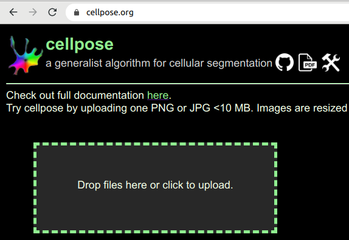

## Cellpose

Volker Bäcker
Montpellier Ressources Imagerie
05.02.2020

***

## Content
* What is cellpose?
* How does it work?
* Online test
* Installation
* Usage
* Batch processing

***

## What is cellpose?

***

## What is cellpose?
* segment cells of different types from different imaging modalities 
    * given an image of the cells
    * optionally an image of stained nuclei
* DL network trained with images of 70000 cells
* a new model to represent cells

***

## How does it work?

<small>

* from ground truth mask
    * create gradient vector field
    * by using simulated diffusion
* train modified UNet to predict gradient vector fields
* applying the model:
    * predict gradient vector fields
    * track each pixel to its attractor
    * all pixels tracked to the same attractor belong to the same cell

</small>

***

## The images

***

## The images

* nd (tif) files 
* 2 channels 
* 2304x1944 16-bit
convert to 8-bit png (or RGB-png) for upload

* =>  First upload trial failed because:
    * conversion of tiff to png resulted in 16-bit png files

***

## Test online

***

## Test online - parameter

* When repeating locally results with same diameter different
    * Is auto-diameter used ???

***

## Test online - result

## Installation

* git clone https://github.com/MouseLand/cellpose.git (or download the zip)
* on windows install Anaconda
* conda env create -f environment.yml
* conda activate cellpose
* pip install cellpose --upgrade
* pip install cellpose[gui]
* python -m cellpose

***

## Cellpose application

***

## Convert to IJ roi

* File>save outline as text for imagej
* run imagej_roi_converter.py from FIJI

***

## Batch Processing

* pip install natsort
* pip install torch==1.7.1+cpu torchvision==0.8.2+cpu torchaudio==0.7.2 -f https://download.pytorch.org/whl/torch_stable.html
* write script similar to the jupyter-notebook run_cellpose.ipynb
* read in a loop the images in a folder
    * apply cellpose
    * save the result

***

## Literature
[1] Stringer, C., Wang, T., Michaelos, M._et al._Cellpose: a generalist algorithm for cellular segmentation._Nat Methods_(2020). https://doi.org/10.1038/s41592-020-01018-x