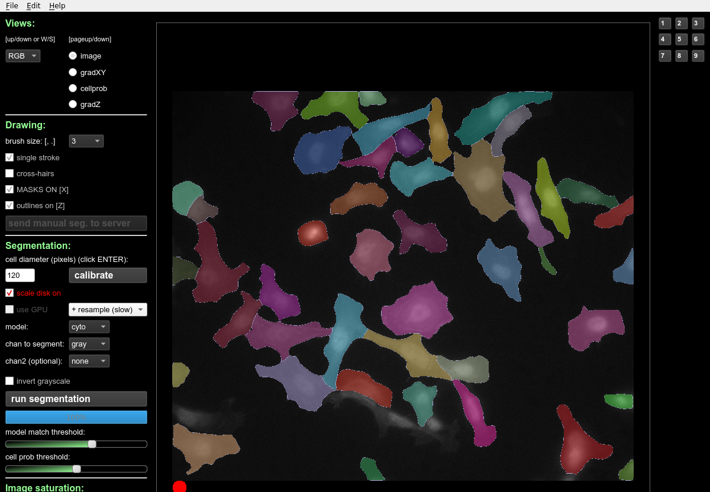
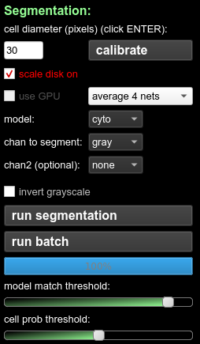
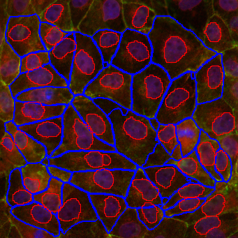

## Cellpose reloaded

Volker Bäcker
Montpellier Ressources Imagerie
04.03.2021

***

## Content
* Remember cellpose?
* New batch button
* New features
* Example result
* Download

***

## Remember cellpose?

***

## New batch button
 

***

## New features
* runs the segmentation on all images in the folder of the current image
* you can run cytoplasm-segmentation followed by nuclei-segmentation
* new macro to batch-convert the segmentation results to rois
* cytoplasm and nuclei segmentation can be run on the same input data 
    * results are added (not overwritten)

***

## Example Result
<small>
 

* rois in overlay
* nuclei rois in group 1 
* cytoplasm rois in group 2
* macro to create membrane rois from cytoplasm rois

</small>

## Download

* https://github.com/MontpellierRessourcesImagerie/cellpose