## The NapariJ-plugin 

Combining the python 3D viewer with FIJI

10.07.2021

Montpellier Ressources Imagerie

Volker Bäcker

***

### Contents

- the 3D spot colocalization example
- what is napari
- napari plugins
- the imagej-python bridge
- the naparij-plugin
- what’s next?

***

<section>
### 3D spot colocalization

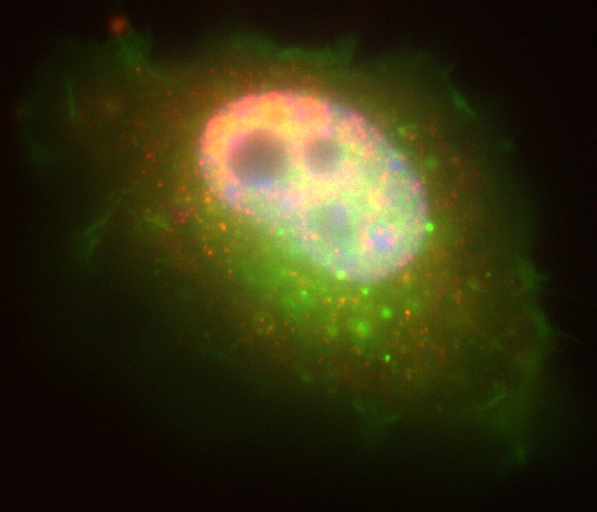

- input:
    - 2 spot channels + <br>nuclei channel
- objectif:
    - for spots not within <br>the nucleus, calculate <br>the shortest distances <br>between spots in <br>channel one and <br>channel two 

***

### Solution with Imaris

<small>

- Create spots channel one:
    - auto-detect + manual selection of ‘quality’ threshold
- Create spots channel two:
    - auto-detect + manual selection of ‘quality’ threshold
- Create surface to segment the nucleus
- From the two spot objects creatre binary masks
- Use the nucleus-surface to remove spots within the nucleus in the two mask channels
- Reconvert the spot mask  channels to spots
- Find all pairs of spots between the two channels which are closer then a given distance 

:) solves the problem &nbsp;&nbsp;&nbsp;&nbsp;   :( can not be automatized 
 
</small>

***

### Solution with FIJI

<small>

- use FeatureJ Laplacian (3D) to create a 3D image in which the minima are the centers of the spots
- use ``3D Maxima Finder`` from the ``3D Suite ImageJ``
- segment the nucleus via thresholding 
- remove points for which the nucleus mask is 255 
- remove points for which the quality is below a threshold
- calculate the shortest distance from each point in one channel to the points in the other channel

:) can be automatized &nbsp;&nbsp;&nbsp;&nbsp; :( hard to set a threshold with out seeing the consequences in 3D

</small>

</section>

***

<section>

### Napari

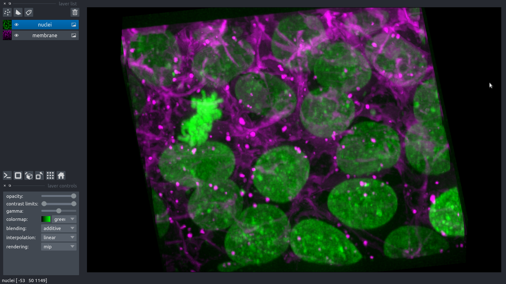
<small>

- 3D viewer
    - dimensions z, t	, ...   (sliders)
    - image layers c
    - point, labels, shape layers with gui tools
    - surface, track, vector layers via python code
    - plugins (widgets or hooks (for example load/save))
    - data is an array like python object
        - can use dask arrays and zarr-files 
            - read big data / read remote data

</small>

***

### Napari plugins

- plugin can be registered
- registered plugins can be installed from within napari

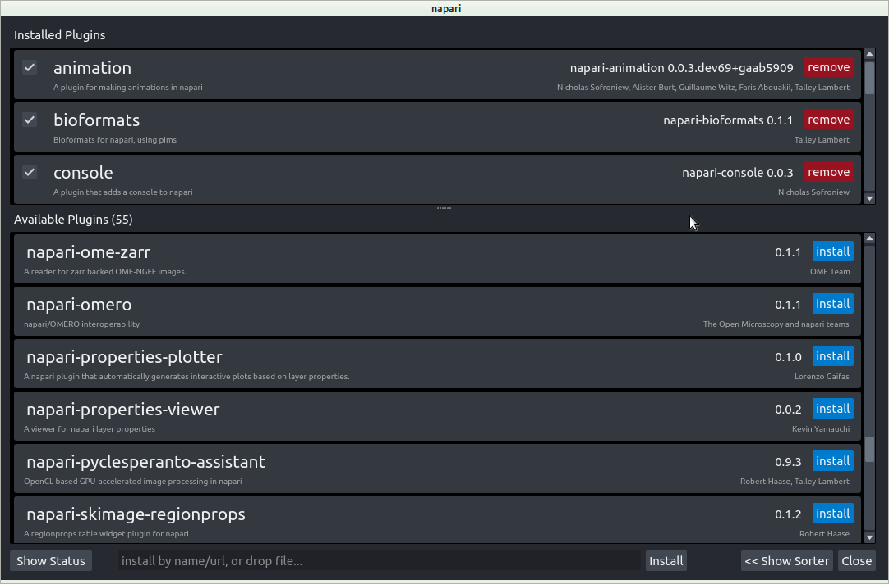

***

### Napari animation plugin

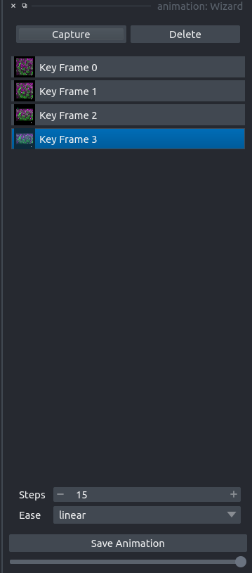


</section>

***

<section>

### The ImageJ-python bridge

- Connect ImageJ and python both ways
- Use jpype to start the jvm 
    - call java from python
    - shared memory 
        - - no copying of data
- Use the jupyter-client
    - send commands from IJ to the ipython kernel
        - the one that started the jvm
  
***
  
### Example python accessing IJ

```python
data = getResulsTable()
display(data)
cal = IJ.getImage().getCalibration()
coords = np.delete(data.values,[3], axis=1)
icoords = [[z, y, x] for [x,y,z] in coords]
zFactor = cal.getZ(1) / cal.getX(1)
points_layer = viewer.add_points(icoords, size=1, scale=[zFactor, 1, 1])
```

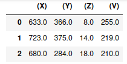
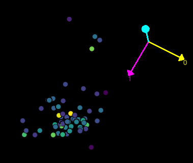

***

### Example IJ accessing python

```python
from ijpb.fiji.IPythonProxy import IPythonProxy
p = IPythonProxy()
p.run("import napari")
p.run("from PyQt5 import QtCore")
p.run("viewer = napari.Viewer()")
p.disconnect()
```

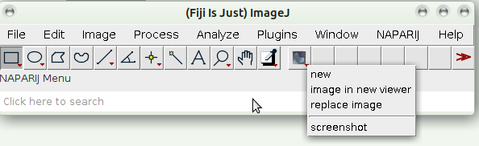

</section>

***

<section>

### The naparij-plugin

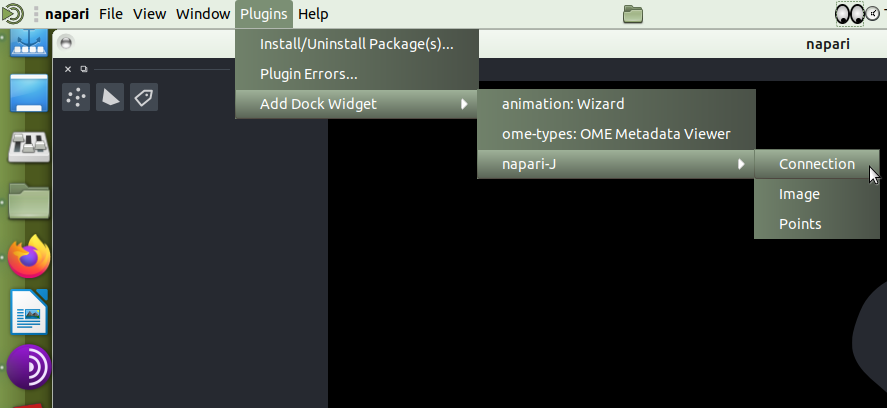
 
 ***
 
### Connection

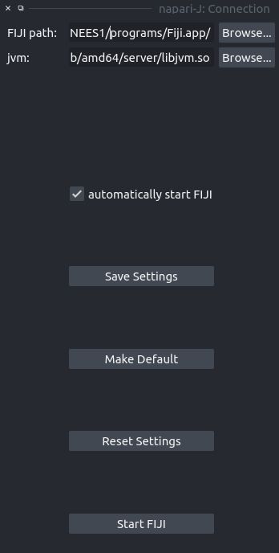

<small>

- start the jvm
- set ``jupter_connection_file`` <br>and ``python_executable`` in IJ
    - so that the IPython proxy can connect back

</small>

***

### Image

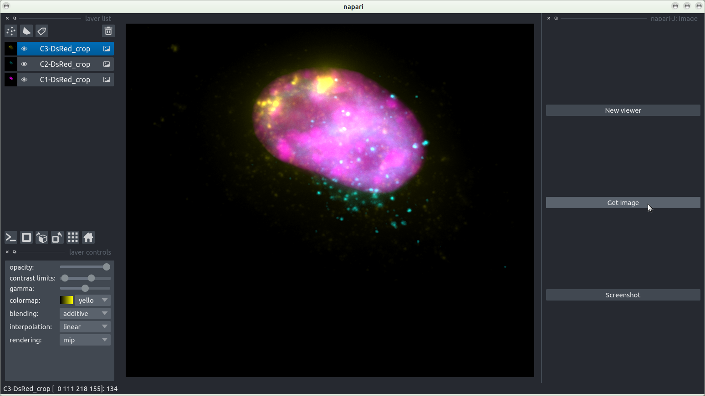

***

### Points

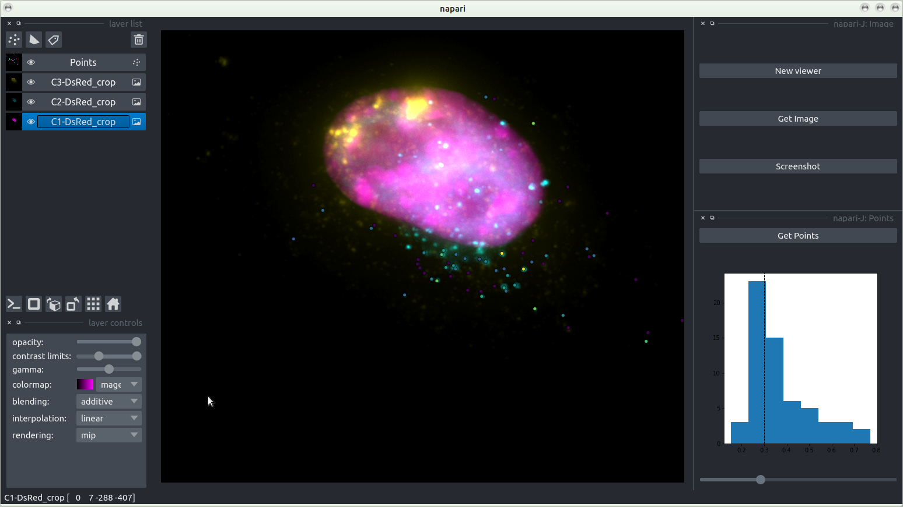

***

### Points (zoom)

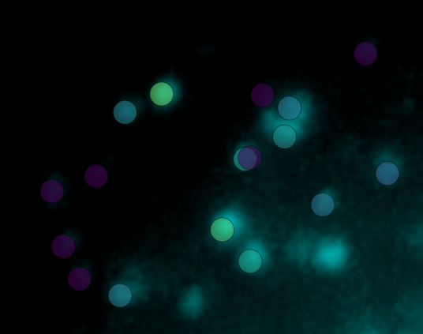

</section>

***

<section>

### What’s next?

<small>

- finish the naparij-plugin
    - send the filtered points back to IJ
- finish the analysis
    - calculate the distances
- Add features to the plugin
    - 3D object counter (segmentation) to napari surfaces and back
    - tracks, vector-fields, ???, …
- Use the ImageJ-python bridge with other python software
    - clustering / ML / DL 
    - give DL4Mic more control over the python process
- IJPB can also be used to connect to a distant IPython via ssh-tunneling
    - run on server, in the cloud or on a cluster

</small>