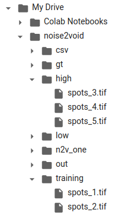
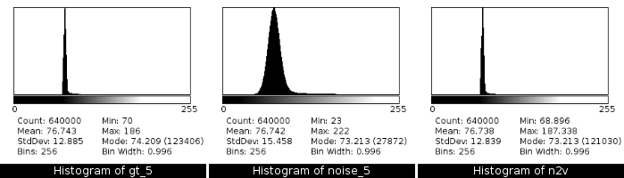
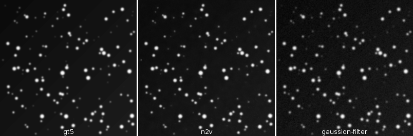

### Zero Cost Deep-Learning for Microscopy

Volker Bäcker

Montpellier Ressources Imagerie

29/04/2020

***

### Content

1. What is ZeroCostDL4Mic?
2. Experience Report Noise2Void
3. Conclusions

***

### 1.1 Spoiler

* Is it really for free?
    * yes 
    * some restrictions, but usable

***

### 1.2 What problem does it solve?

* We’ve seen a lot of publications applying deep-learning for microscopy
* But difficult to use for most, because they need to be trained on our data 
    * need cloud/GPU/cluster access 
    * need to get the images to the cloud/GPU/cluster
    * need programming skills
    * need DL basics to select the training parameters  

***

### 1.3 How does it help?

* prepared jupyter notebooks 
* start them on google colab by clicking on a button
* the text walks you through the process step by step
* you don’t have to touch any code
    * everything is done via a graphical user interface in the notebook
* access to your data via your google-drive

***

### 1.4 What can I do with it?

* There are currently 5 models:
 
 <small>
 
| model              | application |
|--------------------|-------------|
| UNet               | segmentation,  EM, brightfield images |
| Stardist (2D/3D)   | nuclei segmentation, DAPI, Hoechst    |
| Noise2Void (2D/3D) | denoising, unsupervised - no ground truth images needed |
| CARE (2D/3D)       | image restoration, low SNR to high SNR |
| fnet               | create fluorescent image from brightfield image         |
</small>

***

### 1.5 How to get started?

* Start at the project’s wiki
    * [ZeroCostDL4Mic/wiki](https://github.com/HenriquesLab/ZeroCostDL4Mic/wiki)
* You need
    * a google account
    * enough free space in your google-drive
* Click on the “Open in colab”-button to start a notebook in colab
* Follow the instructions in the notebook

***

### 1.6 What are the restrictions?

* One training/prediction unit can max. take 12h
    * colab disconnects every 12 hours 
        * to make crypto-currency mining impossible
* free google-drive provides 15GB of disk-space
* colab distributes GPUs/TPUs according to availability
    * you get access to GPUs/TPUs according to 
        * availability
        * your previous usage

***

### 1.7 Related resources

* Look here for the paper and some videos
    * [ZeroCostDL4Mic](https://github.com/MontpellierRessourcesImagerie/ZeroCostDL4Mic)
* A simple example of training and using a network	
    * [DL_EXP_PC/](https://montpellierressourcesimagerie.github.io/DL_EXP_PC/)
* The slides of day 2 of the MRI workshop
    * [mri-workshop-machine-learning](https://github.com/MontpellierRessourcesImagerie/mri-workshop-machine-learning)
 
***

###  2.1 Noise2Void Experience

* the images (800x800 8-bit)

***

### 2.2 Image Upload

* upload to google-drive 
    * 2 images for training, 3 images for predictions

***

### 2.3 Running the noise2void

* run [Noise2VOID_2D_ZeroCostDL4Mic.ipynb](https://colab.research.google.com/github/HenriquesLab/ZeroCostDL4Mic/blob/master/Colab_notebooks/Noise2VOID_2D_ZeroCostDL4Mic.ipynb)
* follow the instructions
* parameters used:
    * number\_of\_epochs: 150
    * patch_size: 64
* training duration: 12min

***

### 2.4 Training Loss 

***

### 2.5 Quality control

* You need ground-truth images to do the quality estimation
* In this case the images are synthetic
* low noise images created with [MRI_Create_Synthetic_Spots_Tool](https://github.com/MontpellierRessourcesImagerie/imagej_macros_and_scripts/wiki/MRI_Create_Synthetic_Spots_Tool)
* noise added separately for foreground and background with ImageJ

***

### 2.6 Quality control results

* SSIM: structural similarity in [0,1], the closer to one the better
* NRMSE: normalized root mean square error, the closer to 0 the better 

***

### 2.7 Results - Images

***

### 2.8 Results - Histograms

***

### 2.9 Results - Plots

***

### 2.10 Results - Metrics

<small>

Calculated with the [SNR-Plugin](http://bigwww.epfl.ch/sage/soft/snr/) [1]

| metric | long name                  |
|--------|----------------------------|
| SNR    | Signal to Noise Ratio      |
| PSNR   | Peak Signal to Noise Ratio |
| RMSE   | Root Mean Square Error     |
| MAE    | Mean Absolute Error        |
[1] D. Sage, M. Unser, [Teaching Image-Processing Programming in Java](http://bigwww.epfl.ch/publications/sage0303.html), IEEE Signal Processing Magazine, vol. 20, no. 6, pp. 43-52, November 2003.

</small>

***

### 2.11 Comparison with Gaussian-Filter

* Is the n2v denoising better than a simple solution?

***

### 2.12 Comparison - Histograms

***

### 2.13 Comparison - Plots

***

### 2.14 Comparison - Metrics

<small>

Calculated with the [SNR-Plugin](http://bigwww.epfl.ch/sage/soft/snr/) [1]

| metric | long name                  |
|--------|----------------------------|
| SNR    | Signal to Noise Ratio      |
| PSNR   | Peak Signal to Noise Ratio |
| RMSE   | Root Mean Square Error     |
| MAE    | Mean Absolute Error        |
[1] D. Sage, M. Unser, [Teaching Image-Processing Programming in Java](http://bigwww.epfl.ch/publications/sage0303.html), IEEE Signal Processing Magazine, vol. 20, no. 6, pp. 43-52, November 2003.

</small>

***

### 3.1 Conclusions noise2void experiment

* Training was fast
* The result “looks” very good
* Higher SNR than the Gaussian-blur filter
* Low intensity spots are lost with n2v
    * For segmentation Gaussian-blur filter might be better (in this case)

***

### 3.2 Conclusions

<small>

* We can use Zero Cost Deep-Learning for Microscopy (all)
* We can setup other DeepLearning-models in the same way (the ML-team) 
* We can train and apply the model 
    * on colab 
    * on analysis pcs (with or without gpus, depending on the model)
    * on our own server (we do not have it yet)
    * possibly on the meso@lr cluster (not setup yet)
* We can apply the trained models from ImageJ

=> Try it on colab to get started

</small>

***

### 3.3 An alternative 

<small>

* [ImJoy](https://imjoy.io/#/) [1]
    * nice environment for deploying DL-models
    * also a number of DL-models for microscopy already [available](https://imjoy.io/repo/)
    * for cloud computing it uses mybinder (only demo)
        * but could user other services
    * more complex for setup and data-access
    * user friendly gui for training and predictions

[1] Ouyang, W., Mueller, F., Hjelmare, M. _et al._ ImJoy: an open-source computational platform for the deep learning era. _Nat Methods_ **16,** 1199–1200 (2019)

</small>